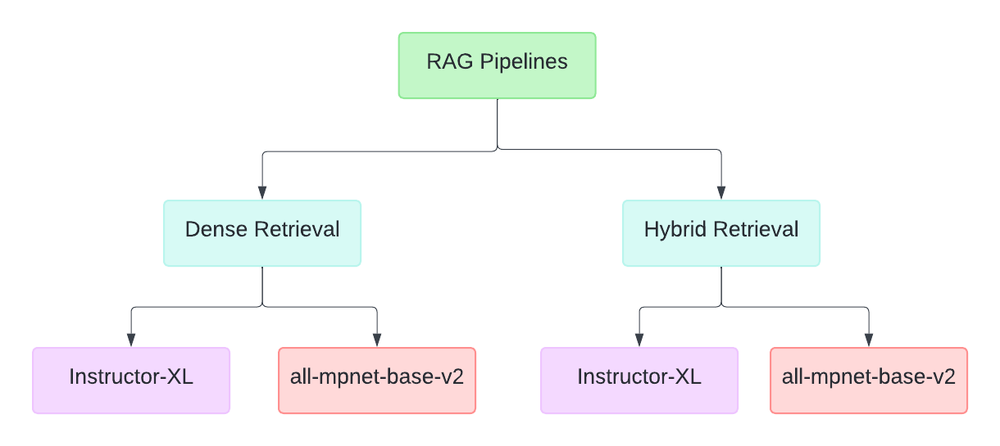
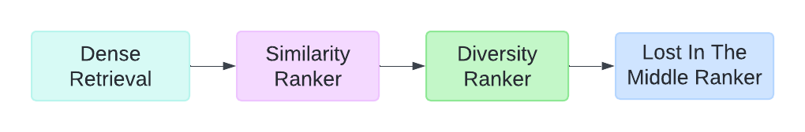
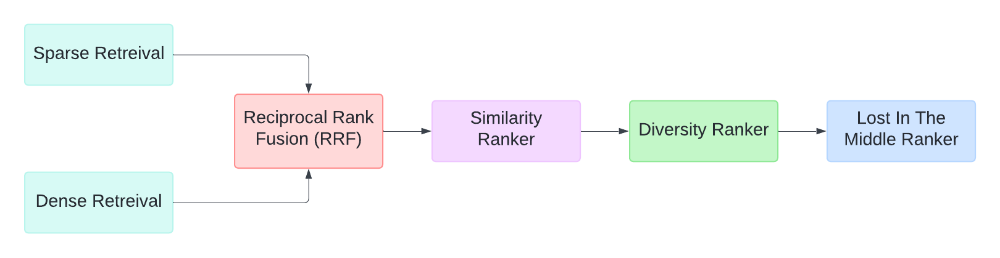

## Performance Evaluation of Rankers and RRF Techniques for Retrieval Pipelines

**Paper:** [Performance Evaluation of Rankers and RRF Techniques for Retrieval Pipelines](paper/rankers_rrf.pdf)

In the intricate world of Long-form Question Answering (LFQA) and Retrieval Augmented Generation (RAG), making the most of the LLM’s context window is paramount. Any wasted space or repetitive content limits the depth and breadth of the answers we can extract and generate. It’s a delicate balancing act to lay out the content of the context window appropriately.

With the addition of three rankers, viz., Diversity Ranker, Lost In The Middle Ranker, Similarity Rankers and RRF techniques, we aim to address these challenges and improve the answers generated by the LFQA/RAG pipelines. We have done a comparative study of adding different combinations of rankers in a Retrieval pipeline and evaluated the results on four metrics, viz., Normalized Discounted Cumulative Gain (NDCG), Mean Average Precision (MAP), Recall and Precision.

In our study, we consider the following cases of retrieval:



The following rankers were used:

- **Diversity Ranker:** The Diversity Ranker enhances the diversity of the paragraphs selected for the context window.

- **Lost In The Middle Ranker:** The Lost In The Middle Ranker optimizes the layout of the selected documents in the LLM’s context window.

- **Transformers Similarity Ranker:** The Transformers Similarity Ranker ranks Documents based on how similar they are to the query. It uses a pre-trained cross-encoder model to embed both the query and the Documents. It then compares the embeddings to determine how similar they are.

**Dense Retrieval:**

For Dense retrieval, `INSTRUCTOR-XL` and `all-mpnet-base-v2` models were employed.



**Hybrid Retrieval:**

BM25 retrieval was used for Sparse retrieval in the Hybrid pipelines. The `bge-reranker-large` model was used in the Similarity Ranker, and `ms-marco-MiniLM-L-12-v2` for the Diversity Ranker.

**Reciprocal Rank Fusion** (RRF) was used to combine the results for Hybrid retrieval.



## Usage

To run the pipelines, you will need to clone this repository and install the required libraries.

1. Install the `rrf` package:

```bash
git clone https://github.com/avnlp/rrf
cd rrf
pip install -e .
```

2. To add the data to an index in Pinecone using the INSTRUCTOR-XL embedding model:

```python
cd src/rrf/indexing_pipeline/fiqa
python pinecone_instructor_index.py
```

3. To run a specific pipeline you will have to go that file path and then run the file.
For example, running the pipeline that uses dense retrieval with a combination of Diversity Ranker, Lost In The Middle Ranker and Similarity Ranker:

```python
cd src/rrf/pointwise/instructor_xl/fiqa/
python dense_similarity_diversity_litm.py
```

## License

The source files are distributed under the [MIT License](https://github.com/avnlp/rrf/blob/main/LICENSE).
